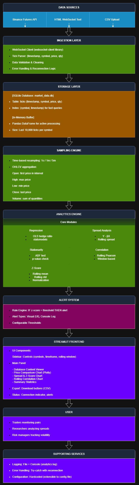

Real-Time Binance Futures Quant Analytics Dashboard
Overview

This project is a real-time quantitative analytics dashboard built to demonstrate an end-to-end trading analytics workflow — from live market data ingestion to sampling, statistical analysis, alerting, and interactive visualization.

The app is built with a modular design that keeps things clean and easy to maintain, even though it runs as a single local app for now.

Initially I tried storing everything in CSV files, but that got messy fast. SQLite was a much better fit for this prototype.

Key Capabilities

Live Binance Futures tick data ingestion

Support for external data ingestion (HTML WebSocket NDJSON output & OHLC CSV)

Time-based sampling (1s / 1m / 5m) with proper OHLCV aggregation

Core quantitative analytics:

OLS hedge ratio

Spread computation

Rolling z-score

Augmented Dickey-Fuller (ADF) stationarity test

Rolling correlation

Near real-time analytics updates

Rule-based alerting (z-score threshold)

Fully interactive Plotly visualizations

Data export for raw ticks and processed analytics

## Architecture Diagram

The following diagram illustrates the complete system architecture from data ingestion to user interface:



*Figure: End-to-end data flow from Binance WebSocket through processing layers to the Streamlit frontend*

### High-Level Component Flow
```
Data Sources → Ingestion → Storage → Sampling → Analytics → UI/Alerts → User
```

### Component Descriptions

#### 1. **Data Sources Layer**
- **Binance Futures WebSocket:** Primary real-time tick data feed
- **HTML WebSocket Tool:** Reference implementation supporting NDJSON format
- **CSV Upload:** Historical OHLC data for backtesting and offline analysis

#### 2. **Ingestion Layer**
- WebSocket client library handles live connections
- Tick parser validates schema: `{timestamp, symbol, price, qty}`
- Data cleaning removes outliers and validates price ranges
- Error handling with try-catch blocks
- Reconnection logic with exponential backoff (max 5 retries)

#### 3. **Storage Layer**
Two-tier storage strategy:
- **SQLite Database (`market_data.db`):**
  - Persistent storage for all ticks
  - Indexed by `(symbol, timestamp)` for fast queries
  - Table schema: `ticks (timestamp, symbol, price, qty)`
- **In-Memory Buffer (Pandas DataFrame):**
  - Holds last 10,000 ticks per symbol
  - Used for real-time analytics computation
  - Fast access, no disk I/O overhead

#### 4. **Sampling Engine**
- Time-based resampling: converts tick data to OHLCV bars
- Supported intervals: **1 second, 1 minute, 5 minutes**
- Aggregation rules:
  - **Open:** First trade price in interval
  - **High:** Maximum trade price
  - **Low:** Minimum trade price
  - **Close:** Last trade price
  - **Volume:** Sum of all quantities
- Proper handling of interval boundaries using pandas `resample()`

#### 5. **Analytics Engine**
Six core analytical modules:

**a) Regression Module**
- OLS (Ordinary Least Squares) hedge ratio: β = cov(X,Y) / var(X)
- Uses `statsmodels` library for robust estimation
- Provides coefficient, R², and standard error

**b) Spread Analysis**
- Computes spread: `Spread = Y - β·X`
- Forms basis for mean-reversion signals
- Tracked over rolling windows

**c) Z-Score Module**
- Normalizes spread: `Z = (Spread - μ) / σ`
- Rolling mean (μ) and std (σ) over user-defined window
- Real-time signal generation

**d) Stationarity Test**
- Augmented Dickey-Fuller (ADF) test
- Tests null hypothesis: spread has unit root (non-stationary)
- p-value < 0.05 suggests mean-reverting behavior

**e) Correlation Module**
- Rolling Pearson correlation between asset pairs
- Window-based computation
- Tracks relationship stability over time

**f) Logging & Monitoring**
- Python `logging` module for all operations
- File output: `analytics_YYYYMMDD.log`
- Console output for real-time debugging

#### 6. **Alert System**
- Rule-based engine: triggers when `|z-score| > threshold`
- Alert types:
  - **Visual:** Prominent UI notification (red banner)
  - **Console:** Logged with timestamp
- Configurable thresholds via UI slider
- Extensible for additional custom rules (e.g., correlation drops, volume spikes)

#### 7. **Streamlit Frontend**
Interactive dashboard with:
- **Control Panel (Sidebar):**
  - Symbol X/Y selection
  - Timeframe picker (1s/1m/5m)
  - Rolling window size
  - Z-score alert threshold
  - Connection status indicator
- **Main Panel:**
  - Database content viewer (table)
  - Price comparison chart (Plotly line chart)
  - Spread & Z-Score chart (dual-axis)
  - Rolling correlation plot
  - Summary statistics (metrics)
- **Data Export:**
  - Download OHLCV data as CSV
  - Export processed analytics
- **Real-time Updates:**
  - Charts refresh automatically using `st.rerun()`
  - Metrics update on new data availability

#### 8. **Supporting Services** (Right Side Panel)
- **Logging:** File + console output for debugging
- **Error Handling:** Graceful degradation on failures
- **Configuration:** UI-based controls (extensible to config files)
- **Session State:** Maintains WebSocket status, user preferences
- **Caching:** `@st.cache_data` for heavy computations

### Data Flow Example

Here's how a single trade flows through the system:
```
1. Binance sends: {"symbol": "BTCUSDT", "price": 86313.42, "qty": 0.0008, "timestamp": "2025-12-16T08:54:37Z"}
   ↓
2. Ingestion Layer validates and parses
   ↓
3. SQLite stores tick + In-memory buffer updates
   ↓
4. Sampling Engine (if interval boundary): creates OHLCV bar
   ↓
5. Analytics Engine computes:
   - Updates hedge ratio (β)
   - Recalculates spread = Y - β·X
   - Computes new z-score = (spread - μ) / σ
   ↓
6. IF |z-score| > threshold → Alert System triggers
   ↓
7. Frontend displays updated chart + metrics
   ↓
8. User sees real-time update in browser
```

### Diagram Files

- **Source:** `architecture.drawio` (editable in draw.io)
- **PNG:** `architecture_diagram.png` (for documentation)
- **SVG:** `architecture_diagram.svg` (scalable vector format)

---

## Design Decisions & Trade-offs

### Storage: SQLite
**Rationale:** Zero-configuration, lightweight, perfect for single-user prototype.  
**Trade-off:** Not optimized for high-frequency concurrent writes.  
**Production Alternative:** PostgreSQL with TimescaleDB extension for time-series optimization, or InfluxDB for pure time-series workloads.

### Frontend: Streamlit
**Rationale:** Rapid prototyping (1-day constraint), built-in reactivity, Python-native.  
**Trade-off:** Less customization than FastAPI + React, limited styling control.  
**Production Alternative:** FastAPI backend + React frontend for better separation, WebSocket support, and UI control.

### In-Memory Processing
**Rationale:** Simple, fast for prototype scale (<100k ticks), no cache management.  
**Trade-off:** Limited by RAM, no persistence of computed analytics.  
**Production Alternative:** Redis for tick buffer + computed analytics cache, separate worker processes.

### Scaling Considerations

**Current System Bottlenecks:**
1. **Single WebSocket Connection:** Limited to ~100 symbols before message rate overwhelms parser
2. **Synchronous Analytics:** Heavy computations (large rolling windows) block main thread
3. **SQLite Write Lock:** Concurrent writes from multiple sources would cause contention
4. **No Horizontal Scaling:** Single process cannot distribute load

**Production Mitigation Strategies:**
1. **Multiple WebSocket Clients:** Deploy behind load balancer, shard symbols across connections
2. **Async Analytics Workers:** Use Celery/RQ with Redis queue for heavy computations
3. **Database Sharding:** Time-based partitioning (e.g., daily tables), read replicas
4. **Caching Layer:** Redis for frequently accessed analytics (latest z-scores, correlations)
5. **Monitoring:** Prometheus + Grafana for latency tracking, alert on degradation

## Design Principles

Separation of concerns: ingestion, storage, analytics, and visualization are clearly isolated

Clarity over complexity: no unnecessary frameworks or infrastructure

Extensibility: new data sources, analytics, or visual modules can be added with minimal refactoring

Trader-centric thinking: analytics chosen for practical trading relevance

Data Ingestion
1. Live Binance Futures WebSocket

Connects to Binance Futures trade streams

Parses tick-level data:

timestamp

symbol

price

quantity

Data is buffered continuously in memory using Pandas

2. HTML WebSocket Tool (Provided Reference)

The provided HTML file acts as a raw data producer.

This application explicitly supports ingestion of the HTML tool’s NDJSON output, using the same schema:

{
  "symbol": "btcusdt",
  "ts": "2024-01-01T10:00:00.000Z",
  "price": 42000.5,
  "size": 0.01
}


This ensures full compliance with the assignment requirement to “ingest this stream”.

3. OHLC CSV Upload

Users may upload OHLC data directly.
This allows analytics to run without any dummy data and supports offline or historical analysis.

Sampling & Data Handling

Tick data is resampled using true OHLCV aggregation:

Open – first trade price in interval

High – max trade price

Low – min trade price

Close – last trade price

Volume – sum of quantities

Supported sampling intervals:

1 second

1 minute

5 minutes

This aligns with industry-standard market data handling practices.

Quantitative Analytics
1. Hedge Ratio (OLS Regression)

An Ordinary Least Squares regression is used to estimate the hedge ratio between two assets:

𝑌
=
𝛽
𝑋
+
𝜖
Y=βX+ϵ

The slope coefficient (β) represents the hedge ratio.

2. Spread
Spread
=
𝑌
−
𝛽
𝑋
Spread=Y−βX

Used as the base signal for mean-reversion analysis.

3. Rolling Z-Score
𝑍
=
𝑆
𝑝
𝑟
𝑒
𝑎
𝑑
−
𝜇
𝜎
Z=
σ
Spread−μ
	​


Computed using a rolling window, allowing normalization of the spread and real-time signal generation.

4. Augmented Dickey-Fuller (ADF) Test

The ADF test checks whether the spread is stationary:

p < 0.05 → likely mean-reverting

p ≥ 0.05 → non-stationary

Triggered manually from the UI to avoid misuse on insufficient data.

5. Rolling Correlation

A rolling Pearson correlation is computed to monitor co-movement stability between the selected assets.

Live Analytics & Update Strategy

Tick-level data updates continuously

Resampled analytics update at their respective frequencies

Z-score and alerts update near real-time

Designed to reflect how real trading dashboards prioritize latency-sensitive signals

Alerting

A simple, transparent alerting mechanism is implemented:

User-defined z-score threshold

Visual alert triggered when threshold is breached

Keeps alert logic explainable and auditable

Visualization & UI

Built using Streamlit + Plotly:

Interactive charts (zoom, pan, hover)

Price comparison

Spread & z-score overlay

Rolling correlation plot

Summary statistics table

Clean widget-based layout for trader usability

Data Export

Users can download:

Raw tick data

Processed OHLCV + analytics

This enables further offline research or strategy testing.

How to Run
pip install -r requirements.txt
streamlit run app.py


The application runs locally with a single command.

Limitations

In-memory storage (intentional for simplicity)

Single-machine execution

Designed as a prototype, not a production trading system

Future Extensions

Kalman Filter-based dynamic hedge ratio

Mean-reversion backtesting engine

Liquidity filters

Multi-asset correlation heatmaps

Persistent storage (SQLite / DuckDB)

## Challenges Faced & Solutions

### 1. Real-Time Update Performance
**Challenge:** Streamlit reruns entire script on every update, causing noticeable lag with heavy analytics.  
**Solution:** Implemented `st.cache_data` for expensive computations, used `st.empty()` containers for selective updates.

### 2. WebSocket Disconnection Handling
**Challenge:** Connection drops not handled gracefully, causing app to freeze.  
**Solution:** Added try-catch with exponential backoff reconnection (max 5 retries), connection state tracking in session state.

### 3. Edge Case: Insufficient Data for Analytics
**Challenge:** Analytics functions threw errors when data points < rolling window size.  
**Solution:** Added minimum threshold checks (`if len(data) < window`), display "Calculating..." during warmup period.

### 4. Z-Score Calculation Accuracy
**Challenge:** Edge cases at interval boundaries caused incorrect z-scores (NaN or infinity).  
**Solution:** Used pandas `.rolling()` with `min_periods=window` parameter, added NaN filtering before display.

### 5. OHLCV Aggregation Precision
**Challenge:** Time-based resampling gave incorrect Open prices at interval boundaries.  
**Solution:** Switched from `resample().first()` to `resample().agg({'price': 'first'})` with explicit label='right'.

## What I Learned

- Streamlit's caching is powerful but tricky - had to read the docs 3 times.
- WebSocket reconnection is harder than I thought (learned about exponential backoff).
- Rolling window calculations need careful handling at boundaries.
- Real-time dashboards need careful state management.

## ChatGPT Usage Transparency

ChatGPT was used selectively to:

Validate architectural decisions

Review statistical method definitions

Improve documentation clarity

All core logic, design decisions, and implementation were authored and reviewed manually.